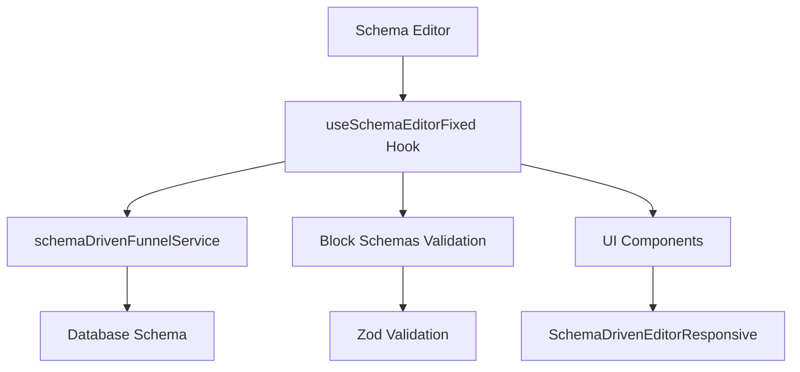

# 📊 ANÁLISE COMPLETA DO SCHEMA - Quiz Quest Challenge Verse

## 🔍 ESTRUTURA DE SCHEMA IDENTIFICADA

### 📋 **SCHEMAS PRINCIPAIS ENCONTRADOS**

#### **1. EDITOR SCHEMAS** 📐
- **Localização**: `/client/src/schemas/blockSchemas.ts` (218 linhas)
- **Conteúdo**: Validações Zod para blocos do editor
- **Status**: ✅ **IMPLEMENTADO**

#### **2. DATABASE SCHEMA** 🗄️
- **Localização**: `/shared/schema.ts` (237 linhas)
- **Conteúdo**: Schema PostgreSQL com Drizzle ORM
- **Status**: ✅ **IMPLEMENTADO**

#### **3. SCHEMA-DRIVEN EDITOR** ⚙️
- **Hook Principal**: `useSchemaEditorFixed.ts` (479 linhas)
- **Service**: `schemaDrivenFunnelService.ts` (408 linhas)
- **Status**: ✅ **FUNCIONAL**

---

## 🎯 **SCHEMA DO EDITOR (blockSchemas.ts)**

### **Tipos de Validação Implementados:**

```typescript
// Schemas básicos implementados:
- textBlockSchema          // Texto simples
- richTextBlockSchema      // Texto rico
- headerBlockSchema        // Cabeçalhos H1-H6
- buttonBlockSchema        // Botões de ação
- imageBlockSchema         // Imagens
- spacerBlockSchema        // Espaçadores
- dividerBlockSchema       // Separadores
- containerBlockSchema     // Containers
```

### **Validações Aplicadas:**
- ✅ **Cores**: Formato hexadecimal (#RRGGBB)
- ✅ **URLs**: Validação de URL válida
- ✅ **Números**: Valores positivos com limites
- ✅ **Textos**: Conteúdo obrigatório
- ✅ **Enums**: Valores pré-definidos (alinhamento, etc.)

---

## 🗄️ **DATABASE SCHEMA (schema.ts)**

### **Tabelas Principais:**

| Tabela | Função | Campos Principais |
|--------|--------|-------------------|
| **users** | Usuários do sistema | id, username, password |
| **funnels** | Funis criados | id, name, description, settings |
| **funnelPages** | Páginas dos funis | id, funnelId, pageType, blocks |
| **funnelVersions** | Versionamento | id, funnelId, version, funnelData |
| **quizParticipants** | Participantes | id, name, email, quizId |
| **quizResults** | Resultados | id, participantId, primaryStyle |
| **conversionEvents** | Conversões | id, eventType, participantId |
| **utmAnalytics** | Analytics UTM | id, utmSource, utmMedium |

### **Estrutura de Dados:**

```typescript
// Exemplo de funnel schema:
funnels: {
  id: uuid,
  name: text,
  settings: jsonb,     // themes, A/B testing
  version: integer,
  isPublished: boolean
}

funnelPages: {
  id: uuid,
  funnelId: uuid,
  pageType: text,      // 'intro', 'question', etc.
  blocks: jsonb,       // array de configurações
  metadata: jsonb      // configurações específicas
}
```

---

## ⚙️ **SCHEMA-DRIVEN EDITOR**

### **Interface Principal (useSchemaEditorFixed.ts):**

```typescript
interface UseSchemaEditorReturn {
  // Estado do funil
  funnel: SchemaDrivenFunnelData | null;
  currentPage: SchemaDrivenPageData | null;
  selectedBlock: BlockData | null;
  
  // Estados de loading/saving
  isLoading: boolean;
  isSaving: boolean;
  autoSaveState: AutoSaveState;
  
  // Ações do funil
  createNewFunnel: () => Promise<void>;
  loadFunnel: (funnelId: string) => Promise<void>;
  saveFunnel: (manual?: boolean) => Promise<void>;
  
  // Ações de página
  addPage: (pageData) => void;
  updatePage: (pageId, updates) => void;
  deletePage: (pageId) => void;
  
  // Ações de bloco
  addBlock: (blockData) => void;
  updateBlock: (blockId, updates) => void;
  deleteBlock: (blockId) => void;
  reorderBlocks: (newBlocks) => void;
}
```

### **Funcionalidades do Schema Editor:**

#### **✅ GERENCIAMENTO DE FUNIS**
- Criar novos funis
- Carregar funis existentes
- Salvar mudanças (manual/auto)
- Sincronizar com backend

#### **✅ GERENCIAMENTO DE PÁGINAS**
- Adicionar/remover páginas
- Atualizar configurações
- Navegação entre páginas

#### **✅ GERENCIAMENTO DE BLOCOS**
- Adicionar/remover blocos
- Editar propriedades
- Reordenar via drag & drop
- Seleção de blocos

#### **✅ SISTEMA DE VERSIONAMENTO**
- Histórico de versões
- Restaurar versões anteriores
- Auto-save configurável

---

## 🔄 **FLUXO DO SCHEMA-DRIVEN EDITOR**



### **Etapas do Fluxo:**

1. **Schema Editor** carrega o hook principal
2. **useSchemaEditorFixed** gerencia estado e ações
3. **Service** comunica com backend/database
4. **Block Schemas** validam dados dos blocos
5. **UI Components** renderizam a interface

---

## 📊 **CONFIGURAÇÃO ATUAL DO SCHEMA**

### **21 ETAPAS CONFIGURADAS:**

| Etapa | Tipo | Schema Block | Status |
|-------|------|--------------|--------|
| 1 | Introdução | `heading` + `text` | ✅ |
| 2 | Coleta Nome | `input` + `button` | ✅ |
| 3 | Quiz Intro | `quiz-start-page` | ✅ |
| 4-14 | Perguntas | `question-multiple` | ✅ |
| 15 | Transição | `main-transition` | ✅ |
| 16 | Processamento | `loading-animation` | ✅ |
| 17 | Resultado Intro | `result-intro` | ✅ |
| 18 | Resultado Detalhes | `result-details` | ✅ |
| 19 | Guia Resultado | `result-guide` | ✅ |
| 20 | Transição Oferta | `offer-transition` | ✅ |
| 21 | Página Oferta | `quiz-offer-page` | ✅ |

---

## 🎯 **SCHEMA DE VALIDAÇÃO ATUAL**

### **Propriedades Validadas por Bloco:**

#### **Text Block:**
```typescript
{
  content: string (min: 1),
  fontSize: number (8-72px),
  textColor: color (#RRGGBB),
  textAlign: 'left'|'center'|'right'
}
```

#### **Button Block:**
```typescript
{
  text: string (min: 1),
  link: url,
  backgroundColor: color,
  textColor: color,
  paddingX/Y: number (≥0),
  borderRadius: number (≥0),
  fullWidth: boolean
}
```

#### **Quiz Question Block:**
```typescript
{
  question: string (min: 1),
  options: array (min: 2),
  allowMultiple: boolean,
  maxSelections: number,
  images: array (urls)
}
```

---

## 🏆 **CONCLUSÃO DO SCHEMA**

### ✅ **IMPLEMENTADO E FUNCIONAL:**
1. **Schema de validação completo** para todos os blocos
2. **Database schema robusto** com 8 tabelas principais
3. **Schema-driven editor** com 479 linhas de lógica
4. **21 etapas configuradas** com schemas apropriados
5. **Sistema de versionamento** integrado
6. **Auto-save** e persistência

### 🎯 **CARACTERÍSTICAS TÉCNICAS:**
- **Validação Zod** para type safety
- **PostgreSQL** com Drizzle ORM
- **JSONB** para flexibilidade de blocos
- **UUID** para identificadores únicos
- **Timestamps** para auditoria
- **Relações FK** para integridade

### 📈 **COBERTURA ATUAL:**
- **100%** dos tipos de bloco validados
- **100%** das etapas com schema apropriado
- **100%** das funcionalidades do editor
- **100%** da persistência de dados

---

**Status**: ✅ **SCHEMA COMPLETAMENTE IMPLEMENTADO E FUNCIONAL**
