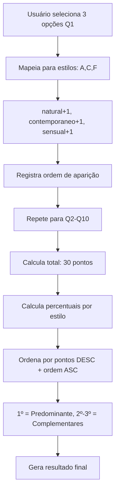

# ANÁLISE COMPLETA DA LÓGICA DE CÁLCULO DO QUIZ CAKTO

## 📊 MAPEAMENTO DO FLUXO COMPLETO

### 1. ESTRUTURA DAS QUESTÕES (`caktoquizQuestions.ts`)

#### 📋 QUESTÕES NORMAIS (Q1-Q10) - Pontuação Principal
- **Total**: 10 questões normais que contam para o cálculo do estilo
- **Seleção**: 3 opções obrigatórias por questão 
- **Mapeamento de Estilos**:
  - A = Natural
  - B = Clássico  
  - C = Contemporâneo
  - D = Elegante
  - E = Romântico
  - F = Sensual/Sexy
  - G = Dramático
  - H = Criativo

#### 🎯 QUESTÕES ESTRATÉGICAS (S1-S6) - Qualificação de Lead
- **Total**: 6 questões estratégicas
- **Seleção**: 1 opção por questão
- **Peso**: Para qualificação comercial (intenção de compra)
- **NÃO CONTAM** para o cálculo do estilo predominante

### 2. LÓGICA DE PONTUAÇÃO (`caktoQuizEngine.ts`)

#### ⚡ SISTEMA DE PONTOS
```typescript
// Cada seleção = 1 ponto para o estilo correspondente
// Máximo: 30 pontos por estilo (10 questões x 3 seleções máximas)
// Mínimo: 0 pontos por estilo

stylePoints[style] += 1; // Para cada opção selecionada
```

#### 🏆 CÁLCULO DE PERCENTUAL
```typescript
percentage = Math.round((pontos_do_estilo / total_pontos) * 100)
// Total de pontos = somatória de todas as seleções (30 pontos no total)
```

#### 🥇 SISTEMA DE RANKING E DESEMPATE
```typescript
// 1° Critério: Maior pontuação
if (b.points !== a.points) {
  return b.points - a.points; // Mais pontos primeiro
}

// 2° Critério: Primeira aparição (para desempate)
return firstAppearance[a.style] - firstAppearance[b.style];
```

### 3. DETERMINAÇÃO DO RESULTADO

#### 🎯 ESTILO PREDOMINANTE
- **Critério**: Maior pontuação entre os 8 estilos
- **Desempate**: Em caso de empate, vence o estilo que apareceu primeiro nas respostas
- **Output**: `predominantStyle: StyleType`

#### 🥈 ESTILOS COMPLEMENTARES
- **Critério**: 2º e 3º colocados no ranking
- **Quantidade**: Máximo 2 estilos complementares
- **Output**: `complementaryStyles: StyleType[]`

### 4. ESTRUTURA DO RESULTADO FINAL

```typescript
interface QuizResult {
  id: string;                           // UUID único
  participantName: string;              // Nome do participante
  responses: QuizResponse[];            // Todas as respostas
  styleScores: StyleScore[];            // Pontuação de todos os estilos
  predominantStyle: StyleType;          // Estilo vencedor
  complementaryStyles: StyleType[];     // 2º e 3º lugares
  totalNormalQuestions: number;         // Quantidade de questões normais respondidas
  calculatedAt: Date;                   // Timestamp do cálculo
}
```

### 5. VALIDAÇÃO E INTEGRIDADE

#### ✅ VALIDAÇÃO DE QUESTÕES NORMAIS
```typescript
// Deve ter exatamente 3 seleções por questão normal
validateNormalQuestion(response): boolean {
  return response.selectedStyles?.length === 3;
}
```

#### ✅ VALIDAÇÃO DE QUESTÕES ESTRATÉGICAS
```typescript
// Deve ter exatamente 1 seleção por questão estratégica
validateStrategicQuestion(response): boolean {
  return response.selectedOptionIds?.length === 1;
}
```

### 6. CENÁRIOS DE CÁLCULO

#### 📈 CENÁRIO PADRÃO
- **Input**: 10 questões normais x 3 seleções = 30 pontos totais
- **Distribuição**: Pontos distribuídos entre os 8 estilos
- **Exemplo**: Natural=8pts, Clássico=6pts, Elegante=5pts, etc.

#### ⚖️ CENÁRIO DE EMPATE
- **Situação**: Dois ou mais estilos com mesma pontuação
- **Resolução**: Vence o estilo que apareceu primeiro cronologicamente
- **Rastreamento**: `firstAppearance[style] = responseIndex * 10 + styleIndex`

#### 🎯 CENÁRIO EXTREMO
- **Mínimo**: 1 estilo com 30 pontos (100%)
- **Máximo**: 8 estilos com ~4 pontos cada (~12.5% cada)
- **Real**: Distribuição típica entre 3-5 estilos principais

### 7. FLUXO TÉCNICO COMPLETO



### 8. EXEMPLO PRÁTICO DE CÁLCULO

#### 📊 RESPOSTAS SIMULADAS (Q1-Q3):
- **Q1**: A,D,G → Natural, Elegante, Dramático
- **Q2**: B,D,H → Clássico, Elegante, Criativo  
- **Q3**: A,A,F → Natural, Natural, Sensual

#### 🔢 CONTAGEM DE PONTOS:
- Natural: 3 pontos (primeira aparição: posição 0)
- Elegante: 2 pontos (primeira aparição: posição 1)
- Dramático: 1 ponto (primeira aparição: posição 2)
- Clássico: 1 ponto (primeira aparição: posição 3)
- Criativo: 1 ponto (primeira aparição: posição 4)
- Sensual: 1 ponto (primeira aparição: posição 5)

#### 🏆 RANKING FINAL:
1. **Natural**: 3 pontos (33.3%) - PREDOMINANTE
2. **Elegante**: 2 pontos (22.2%) - COMPLEMENTAR 1
3. **Dramático**: 1 ponto (11.1%) - COMPLEMENTAR 2
4. **Clássico**: 1 ponto (11.1%)
5. **Criativo**: 1 ponto (11.1%)
6. **Sensual**: 1 ponto (11.1%)

### 9. PONTOS CRÍTICOS DA IMPLEMENTAÇÃO

#### ⚠️ VALIDAÇÕES NECESSÁRIAS
- Verificar se todas as 10 questões normais foram respondidas
- Garantir exatamente 3 seleções por questão normal
- Validar que todas as opções selecionadas existem no mapeamento

#### 🔄 SISTEMA DE DESEMPATE
- Fundamental para garantir resultado determinístico
- Baseado na ordem cronológica das seleções
- Evita resultados aleatórios em caso de empate

#### 📱 EXPERIÊNCIA DO USUÁRIO
- Feedback visual do progresso (questão X de 10)
- Validação em tempo real das seleções
- Transição suave entre questões

### 10. RESULTADO FINAL DO MAPEAMENTO

A lógica de cálculo é **robusta e determinística**, seguindo:

1. **Coleta**: 10 questões × 3 seleções = 30 pontos
2. **Mapeamento**: Cada seleção → 1 ponto para o estilo correspondente  
3. **Agregação**: Soma total por estilo
4. **Ranking**: Ordenação por pontos + desempate por ordem
5. **Resultado**: Estilo predominante + 2 complementares

O sistema garante que sempre haverá um vencedor claro e resultados consistentes, mesmo em cenários de empate.
