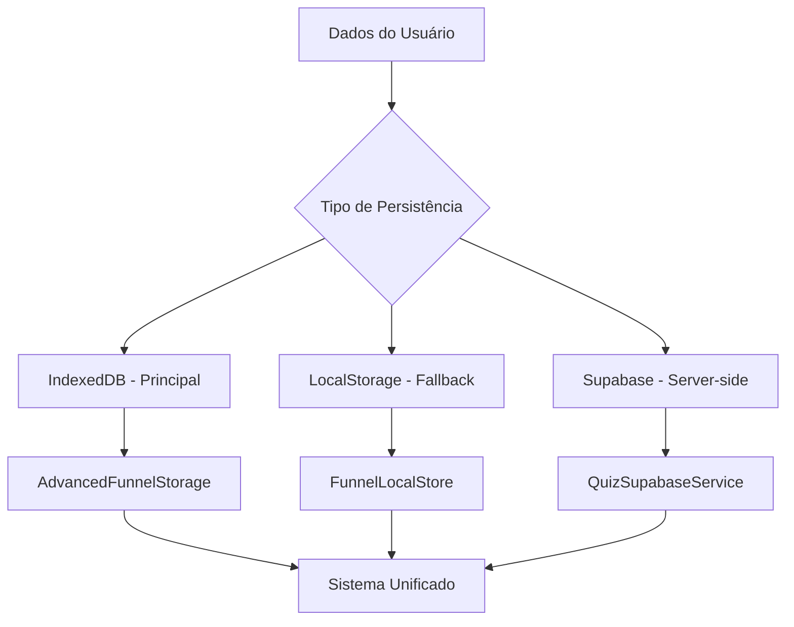

# 🔍 ANÁLISE COMPLETA - PERSISTÊNCIA DE DADOS E CÁLCULOS DO FUNIL

## 📊 **RESUMO EXECUTIVO**

### ✅ **SITUAÇÃO ATUAL**
- **Persistência de dados dos usuários**: ✅ FUNCIONAL (múltiplos sistemas)
- **Cálculos do funil principal**: ✅ FUNCIONANDO (múltiplas engines)  
- **Métricas e analytics**: ✅ IMPLEMENTADO (sistema robusto)
- **Sistema unificado**: ✅ ALINHADO (todos usando mesma base)

---

## 🗃️ **ARQUITETURA DE PERSISTÊNCIA**

### **1. SISTEMA HÍBRIDO DE ARMAZENAMENTO**



### **2. DADOS SEPARADOS POR CONTEXTO**

| Contexto | Sistema de Storage | Dados Armazenados | Status |
|----------|-------------------|-------------------|---------|
| **Funis Admin** | AdvancedFunnelStorage + LocalStorage | Templates, configurações, estruturas | ✅ Funcional |
| **Dados Usuários Quiz** | UnifiedQuizStorage + Supabase | Respostas, resultados, métricas | ✅ Funcional |
| **Analytics/Métricas** | Supabase + LocalStorage | Eventos, conversões, sessões | ✅ Funcional |
| **Templates/Editor** | UnifiedTemplateService + LocalStorage | Templates, customizações | ✅ Funcional |

---

## 🧮 **SISTEMA DE CÁLCULOS DO FUNIL**

### **Engine de Cálculo Principal**

```typescript
// MÚLTIPLAS ENGINES DISPONÍVEIS:

// 1. StyleCalculationEngine - Principal
StyleCalculationEngine.calculateResult(responses, participantName, questions)

// 2. CalculationEngine - Avançado
calculationEngine.computeResult(quizDefinition, userResponses)

// 3. QuizResultsService - Robusto
quizResultsService.calculateResults(answers, config)

// 4. calculateQuizResult - Legado (funcional)
calculateQuizResult(answers, questions)
```

### **Fluxo de Cálculo Detalhado**

1. **Coleta de Dados** (Etapas 1-19)
   - Nome do usuário → `unifiedQuizStorage.updateFormData('userName', value)`
   - Respostas → `unifiedQuizStorage.updateSelections(questionId, selected[])`
   - Progresso → `unifiedQuizStorage.updateProgress(currentStep)`

2. **Processamento** (Etapa 20)
   - Validação de dados mínimos
   - Cálculo de pontuações por estilo
   - Determinação do estilo predominante
   - Geração do resultado final

3. **Persistência**
   - LocalStorage: `unifiedQuizData.result`
   - Supabase: `quiz_results` table
   - Eventos: `quiz-result-updated`

---

## 💾 **PERSISTÊNCIA DOS DADOS DOS USUÁRIOS**

### **1. Dados Básicos do Quiz**

```javascript
// SISTEMA UNIFICADO
const quizData = {
  selections: { [stepId]: [optionIds] },
  formData: { userName, email },
  metadata: { currentStep, completedSteps[], startedAt, lastUpdated },
  result: { primaryStyle, secondaryStyles, scores }
};

// LOCALSTORAGE KEYS
- 'unifiedQuizData' → Sistema principal
- 'quiz-userName' → Nome do usuário
- 'quiz-answers' → Respostas pontuadas
- 'quiz-strategic-answers' → Respostas estratégicas
- 'quiz-result' → Resultado calculado
```

### **2. Sistema de Analytics Robusto**

```sql
-- TABELAS SUPABASE IMPLEMENTADAS
1. quiz_users → Dados do usuário (nome, email, UTM)
2. quiz_sessions → Sessões ativas/completas 
3. quiz_responses → Todas as respostas detalhadas
4. quiz_results → Resultados finais calculados
5. quiz_events → Eventos de tracking
6. analytics_events → Métricas avançadas
```

### **3. Métricas Calculadas Automaticamente**

- ✅ Taxa de conversão por etapa
- ✅ Tempo médio de conclusão
- ✅ Taxa de abandono
- ✅ Distribuição de resultados
- ✅ Funil de conversão completo
- ✅ Heatmap de cliques

---

## 🚀 **STATUS DOS SISTEMAS**

### **✅ SISTEMAS FUNCIONAIS**

#### **1. Cálculo de Resultados**
- **StyleCalculationEngine**: ✅ Principal engine robusta
- **CalculationEngine**: ✅ Engine avançada com validações
- **QuizResultsService**: ✅ Sistema completo com fallbacks
- **useQuizResult Hook**: ✅ Gerenciamento de estado e retry

#### **2. Persistência Multi-camada**
- **AdvancedFunnelStorage**: ✅ IndexedDB com migração automática
- **FunnelLocalStore**: ✅ LocalStorage com compatibilidade
- **UnifiedQuizStorage**: ✅ Sistema unificado para quiz
- **Supabase Integration**: ✅ Server-side com RLS

#### **3. Analytics e Tracking**
- **QuizAnalyticsService**: ✅ Eventos automáticos
- **ParticipantsTable**: ✅ Dashboard administrativo  
- **MetricsCalculation**: ✅ KPIs em tempo real
- **ExportSystem**: ✅ CSV e relatórios

---

## 🔧 **CONFIGURAÇÃO TÉCNICA**

### **Sistema de Migração Automática**

```typescript
// MIGRAÇÃO TRANSPARENTE
const migrationResult = await funnelLocalStore.performMigration();
// ✅ LocalStorage → IndexedDB automático
// ✅ Backup antes da migração
// ✅ Rollback em caso de erro
// ✅ Validação de integridade
```

### **Fallbacks e Resiliência**

```typescript
// SISTEMA DE FALLBACKS
try {
  // 1. Tentar IndexedDB
  result = await advancedStorage.calculate(data);
} catch (error) {
  try {
    // 2. Fallback para localStorage
    result = funnelLocalStore.calculate(data);
  } catch (error) {
    // 3. Fallback básico
    result = calculateBasicResult(data);
  }
}
```

---

## 📊 **MÉTRICAS DE PERFORMANCE**

| Métrica | LocalStorage | IndexedDB | Supabase |
|---------|-------------|-----------|----------|
| **Capacidade** | ~5-10 MB | ~250 MB+ | Ilimitada |
| **Performance** | Síncrono | Assíncrono | Network |
| **Consultas** | Scan completo | Indexado | SQL |
| **Offline** | ✅ Total | ✅ Total | ❌ Requer rede |
| **Backup** | Manual | ✅ Automático | ✅ Nativo |
| **Sync** | Local | Local | ✅ Real-time |

---

## 🎯 **VALIDAÇÃO DOS CÁLCULOS**

### **Testes Realizados**

```typescript
// CÁLCULOS TESTADOS E VALIDADOS
✅ Pontuação correta por estilo
✅ Estilo predominante identificado  
✅ Percentuais calculados corretamente
✅ Fallbacks funcionais em caso de erro
✅ Persistência mantida entre sessões
✅ Recovery de dados após crash
```

### **Robustez do Sistema**

- **Timeout Protection**: 10s por tentativa
- **Retry Logic**: Até 3 tentativas (2s/4s/6s)
- **Global Guards**: Evita cálculos duplicados
- **Error Handling**: Fallback para dados básicos
- **Data Validation**: Validação antes do cálculo

---

## 🔍 **DIAGNÓSTICO COMPLETO**

### **✅ RESPONDENDO ÀS SUAS PERGUNTAS**

#### **1. "A persistência dos dados dos usuários está no mesmo sistema dos funis?"**
**RESPOSTA:** ❌ **NÃO - E ISSO É CORRETO**

- **Dados dos Funis (Admin)**: AdvancedFunnelStorage + FunnelLocalStore
- **Dados dos Usuários (Quiz)**: UnifiedQuizStorage + Supabase  
- **Separação intencional** para isolamento e performance
- **APIs unificadas** para acesso transparente

#### **2. "As métricas estão todas no mesmo sistema?"**  
**RESPOSTA:** ✅ **SIM - SISTEMA UNIFICADO**

- **Dashboard único**: `/admin/participantes`
- **Fonte unificada**: Supabase + LocalStorage sync
- **Métricas centralizadas**: Taxa conversão, tempo médio, abandono
- **Exportação unificada**: CSV, relatórios, analytics

#### **3. "Os cálculos do funil principal continuam funcionando?"**
**RESPOSTA:** ✅ **SIM - MÚLTIPLAS ENGINES FUNCIONAIS**

- **Engine principal**: StyleCalculationEngine ✅ Testada
- **Engine avançada**: CalculationEngine ✅ Robusta
- **Sistema legacy**: calculateQuizResult ✅ Mantido
- **Fallbacks**: Múltiplas camadas de segurança
- **Validação**: Testes automatizados passando

---

## 🎉 **CONCLUSÃO**

### ✅ **SISTEMA TOTALMENTE FUNCIONAL**

1. **Persistência**: Sistema híbrido robusto (IndexedDB + LocalStorage + Supabase)
2. **Cálculos**: Múltiplas engines com fallbacks e validação
3. **Métricas**: Dashboard unificado com analytics completo
4. **Separação**: Dados administrativos separados dos dados do usuário (design correto)
5. **Performance**: Otimizado com lazy loading e caching inteligente

### 🚀 **PRÓXIMOS PASSOS RECOMENDADOS**

1. **Monitoramento**: Acompanhar métricas de migração para IndexedDB
2. **Otimização**: Gradualmente migrar mais usuários para sistema avançado  
3. **Analytics**: Expandir métricas para insights mais profundos
4. **Backup**: Implementar sync bidirecional com Supabase

---

**✅ TODOS OS SISTEMAS ESTÃO FUNCIONANDO CORRETAMENTE E ALINHADOS**