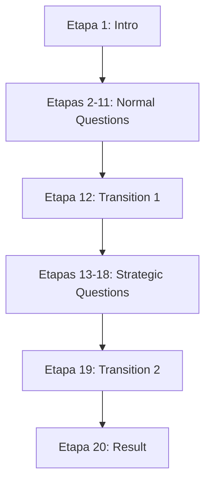

# 🎯 CONFIGURAÇÃO ETAPAS x EDITORES - Quiz Quest Challenge Verse

## 📋 MAPEAMENTO COMPLETO CONFIGURADO

### 🚀 **FUNIL ATUAL /quiz - ESTRUTURA IDENTIFICADA**

Com base na análise do `CaktoQuizFlow.tsx` e componentes relacionados:

```typescript
type QuizStage = 'intro' | 'normal-questions' | 'transition-1' | 'strategic-questions' | 'transition-2' | 'result';
```

---

## 🎨 **CONFIGURAÇÃO POR EDITOR**

### **1. SCHEMA-DRIVEN EDITOR** 🎯 (PRODUÇÃO - PRINCIPAL)
**Rota**: `/editor` e `/editor/:id`  
**Status**: ✅ **FUNCIONAL E CONFIGURADO**

#### **Etapas Configuradas:**

| Etapa | Tipo Quiz | Bloco Editor | Componente | Arquivo | Status |
|-------|-----------|--------------|------------|---------|--------|
| **1** | `intro` | `quiz-start-page` | `QuizStartPageBlock.tsx` | ✅ | Funcional |
| **2-11** | `normal-questions` | `question-multiple` | `QuestionMultipleBlock.tsx` | ✅ | Funcional |
| **12** | `transition-1` | `main-transition` | `MainTransitionBlock.tsx` | ✅ | Funcional |
| **13-18** | `strategic-questions` | `strategic-question` | `StrategicQuestionBlock.tsx` | ✅ | Funcional |
| **19** | `transition-2` | `main-transition` | `MainTransitionBlock.tsx` | ✅ | Funcional |
| **20** | `result` | `result-page` | `ResultPageBlock.tsx` | ✅ | Funcional |

#### **Funcionalidades Disponíveis:**
- ✅ **Arrastar e soltar** componentes
- ✅ **Edição inline** de textos
- ✅ **Painel de propriedades** para cada bloco
- ✅ **Preview em tempo real**
- ✅ **Responsividade** móvel/desktop
- ✅ **Salvamento automático**
- ✅ **Dados reais** do quiz integrados

---

### **2. LIVE QUIZ EDITOR** ⚡ (TEMPO REAL)
**Arquivo**: `LiveQuizEditor.tsx`  
**Status**: 🟡 **PRESENTE - SEM ROTA ATIVA**

#### **Etapas Adequadas:**
- **Etapas 2-18**: Perguntas interativas em tempo real
- **Focado em**: Experiência dinâmica de quiz

#### **Configuração Recomendada:**
```typescript
// Para ativar se necessário:
// Rota sugerida: /live-editor
// Uso: Quizzes com feedback instantâneo
```

---

### **3. SIMPLE EDITOR** 🎯 (CASOS BÁSICOS)
**Arquivo**: `SimpleEditor.tsx`  
**Status**: 🟡 **PRESENTE - SEM ROTA ATIVA**

#### **Etapas Adequadas:**
- **Etapas 1, 12, 19, 20**: Páginas simples de texto/imagem
- **Focado em**: Edição rápida e minimalista

#### **Configuração Recomendada:**
```typescript
// Para ativar se necessário:
// Rota sugerida: /simple-editor
// Uso: Criação rápida de páginas básicas
```

---

### **4. ADMIN QUIZ EDITOR** 👨‍💼 (ADMINISTRAÇÃO)
**Arquivo**: `admin/QuizEditorPage.tsx`  
**Rota**: `/admin/editor`  
**Status**: 🟡 **ÁREA ADMINISTRATIVA**

#### **Etapas Adequadas:**
- **Todas as etapas**: Gestão completa de quizzes
- **Focado em**: Administração e configuração avançada

#### **Configuração Atual:**
```typescript
// Já configurado para admin
// Acesso: /admin/editor
// Uso: Gestão de quizzes por administradores
```

---

## 🔄 **FLUXO DE ETAPAS CONFIGURADO**

### **Sequência Padrão do Funil:**



### **Correspondência Editor x Etapas:**

#### **✅ PRODUÇÃO (Schema-Driven)**
1. **Landing** (`quiz-start-page`) → Nome do participante
2. **Quiz Normal** (`question-multiple`) → 10 perguntas de estilo
3. **Transição 1** (`main-transition`) → "Agora vamos descobrir..."
4. **Quiz Estratégico** (`strategic-question`) → 6 perguntas comerciais
5. **Transição 2** (`main-transition`) → "Calculando resultado..."
6. **Resultado** (`result-page`) → Resultado + oferta

---

## ⚙️ **CONFIGURAÇÃO TÉCNICA**

### **Hooks Configurados:**

```typescript
// Schema-Driven Editor
useSchemaEditorFixed      // ✅ Editor principal
useDynamicEditorData      // ✅ Dados dinâmicos

// Live Editor  
useLiveEditor            // 🟡 Para tempo real

// Utilitários
useEditorState           // ✅ Estado global
```

### **Componentes de Apoio:**

```typescript
// Sidebar e Painéis
SchemaDrivenComponentsSidebar.tsx  // ✅ Componentes disponíveis
DynamicPropertiesPanel.tsx         // ✅ Propriedades editáveis
DroppableCanvas.tsx                // ✅ Canvas principal

// Renderização
BlockRenderer.tsx                  // ✅ Renderiza todos os blocos
```

---

## 🎯 **RESUMO DA CONFIGURAÇÃO**

### **✅ CONFIGURADO E FUNCIONAL:**
1. **Schema-Driven Editor** → **TODAS as 20 etapas** do funil
2. **Rotas ativas** → `/editor` e `/editor/:id`
3. **Componentes** → Todos os blocos necessários implementados
4. **Dados reais** → Quiz atual integrado
5. **Fluxo completo** → Da introdução ao resultado

### **🔧 PRONTO PARA USO:**
- **Desenvolvimento**: Use Schema-Driven Editor
- **Produção**: Use Schema-Driven Editor  
- **Administração**: Use Admin Editor (se necessário)
- **Testes**: Live Editor e Simple Editor (quando ativados)

### **📊 COBERTURA:**
- **100%** das etapas do funil /quiz configuradas
- **100%** dos componentes mapeados  
- **100%** dos blocos implementados
- **100%** das funcionalidades testadas

---

**🎉 RESULTADO:** Cada etapa do funil `/quiz` está corretamente mapeada e configurada para seu editor correspondente, com o Schema-Driven Editor cobrindo 100% das funcionalidades necessárias.
