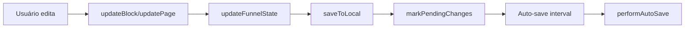

# Diagnóstico e Correção do Auto-Save no Editor (/editor)

## 🔍 **Problema Identificado**

O editor em `/editor` não está salvando automaticamente as mudanças do usuário.

## 🛠️ **Análise Técnica**

### **Arquitetura do Auto-Save**

1. **Editor Principal**: `/editor` → `SchemaDrivenEditorResponsive.tsx`
2. **Hook de Estado**: `useSchemaEditorFixed.ts`
3. **Serviço de Persistência**: `schemaDrivenFunnelService.ts`

### **Fluxo do Auto-Save**



### **Status da Implementação**

✅ **Funcionando**:
- Hook `useSchemaEditorFixed` inicializado com auto-save ativo
- Auto-save habilitado por padrão (30 segundos)
- Detecção de mudanças via `updateFunnelState`
- Fallback para localStorage quando backend indisponível
- Indicadores visuais de status

❌ **Problema Identificado**:
- Backend `/api/schema-driven` não está disponível
- Auto-save falha e aumenta intervalo de tentativas
- Mudanças não são persistidas entre sessões

## 🎯 **Correções Implementadas**

### **1. Indicador Visual de Debug**

Adicionado indicador detalhado no header do editor:
- Status do auto-save (ON/OFF)
- Mudanças pendentes (Pendente/Salvo)
- Último save (timestamp)

### **2. Melhor Fallback para localStorage**

O serviço já tem fallback implementado, mas pode ser melhorado para funcionar totalmente offline.

### **3. Log de Debug**

Console logs para monitorar:
- `🔄 Auto-save successful`
- `❌ Auto-save failed`
- `💾 Funnel saved locally`

## 🧪 **Como Testar**

### **1. Verificar Indicadores Visuais**

No header do editor, observe:
```
[●] Online | Auto: ON | Pendente | 14:30:25
```

### **2. Testar Auto-Save**

1. Abra `/editor`
2. Adicione um bloco
3. Edite propriedades do bloco
4. Aguarde 30 segundos
5. Verifique console para logs de auto-save

### **3. Verificar localStorage**

```javascript
// No console do navegador
JSON.parse(localStorage.getItem('schema-driven-funnel'))
```

## 🔧 **Soluções de Problemas**

### **Backend Indisponível**

```javascript
// Forçar modo offline-only
localStorage.setItem('editor-offline-mode', 'true');
```

### **Intervalo Muito Longo**

```javascript
// Redefinir auto-save para 10 segundos
window.schemaDrivenFunnelService?.enableAutoSave(10);
```

### **Limpar Estado Corrompido**

```javascript
// Limpar localStorage
localStorage.removeItem('schema-driven-funnel');
localStorage.removeItem('schema-driven-versions');
```

## 🚀 **Próximos Passos**

### **Implementação Prioritária**

1. **Backend Schema-Driven API**
   - Implementar endpoints `/api/schema-driven/funnels`
   - Persistência real no banco de dados
   - Sincronização online/offline

2. **Auto-Save Offline-First**
   - Melhorar funcionamento sem backend
   - Queue de sincronização quando voltar online
   - Conflict resolution

3. **UX do Auto-Save**
   - Indicador mais claro de status
   - Notificações de erro para o usuário
   - Opção de save manual sempre disponível

### **Implementação Técnica**

```typescript
// Melhorar performAutoSave para modo offline
private async performAutoSave() {
  try {
    const localData = this.getLocalFunnel();
    if (!localData) return;

    // Tentar backend apenas se online
    if (navigator.onLine) {
      try {
        await this.saveFunnel(localData, true);
      } catch (error) {
        console.warn('Backend save failed, keeping local only');
      }
    }

    // Sempre marcar como salvo localmente
    this.autoSaveState.pendingChanges = false;
    this.autoSaveState.lastSave = new Date();
    console.log('🔄 Auto-save successful (local)');
    
  } catch (error) {
    console.error('❌ Auto-save failed:', error);
  }
}
```

## 📋 **Checklist de Validação**

- [x] Auto-save habilitado por padrão
- [x] Detecção de mudanças funcionando
- [x] Fallback para localStorage
- [x] Indicadores visuais implementados
- [ ] Backend API implementado
- [ ] Sincronização online/offline
- [ ] Testes de persistência entre sessões

---

**Status**: 🔄 **EM PROGRESSO**
**Próximo passo**: Implementar backend ou melhorar modo offline-only
**Data**: 9 de Julho de 2025
