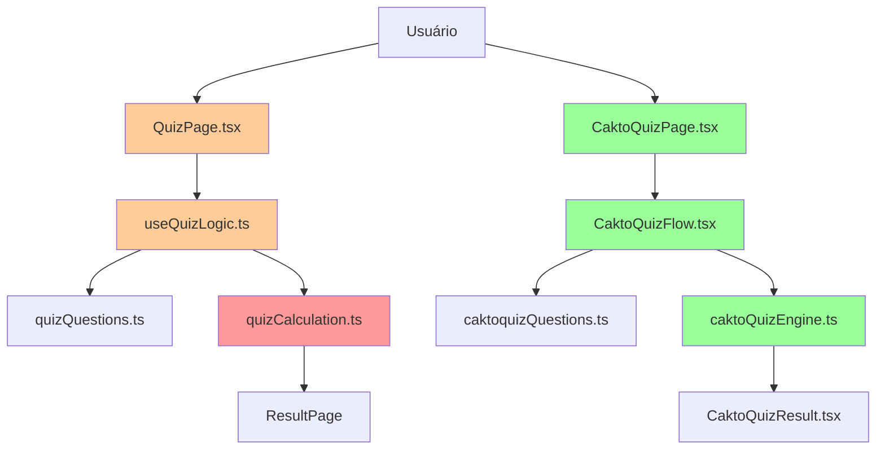

# 🎯 DIAGNÓSTICO FINAL: MAPA VISUAL DE GARGALOS E SOLUÇÕES

## 🚨 RESUMO EXECUTIVO

**STATUS ATUAL**: 🟡 FUNCIONAL MAS COM GARGALOS CRÍTICOS
**COMPLEXIDADE**: 🔴 ALTA DEMAIS (400+ arquivos)
**MANUTENIBILIDADE**: 🔴 DIFÍCIL
**PERFORMANCE**: 🟡 MEDIANA

---

## 📊 GARGALOS IDENTIFICADOS

### 🔴 CRÍTICOS (Resolução Imediata)

```
1. DUPLICAÇÕES CONFLITANTES
├── QuizContent.tsx (2 versões)
├── use-mobile.ts/.tsx (2 versões)  
└── ImageChecker.js/.ts (2 versões)

2. SISTEMAS COMPETINDO
├── QuizPage.tsx vs CaktoQuizPage.tsx
├── QuizFlow.tsx vs CaktoQuizFlow.tsx
└── 4 engines de cálculo diferentes

3. LÓGICA FRAGMENTADA
├── useQuizLogic.ts
├── caktoQuizEngine.ts
├── quizCalculation.ts
└── resultsCalculator.ts
```

### 🟡 MÉDIOS (Otimização)

```
4. ARQUIVOS DESNECESSÁRIOS
├── 50+ utilitários sem uso claro
├── Componentes de editor no quiz
└── Configurações espalhadas

5. IMAGENS MAL ORGANIZADAS
├── URLs quebradas residuais
├── Múltiplos sistemas de otimização
└── Preload ineficiente
```

---

## 🎨 FLUXO ATUAL (PROBLEMÁTICO)



**🔴 Vermelho**: Problemas críticos
**🟡 Laranja**: Confusão/duplicação  
**🟢 Verde**: Funcionando corretamente

---

## 🧹 PLANO DE LIMPEZA PRIORITÁRIO

### 🚀 FASE 1: LIMPEZA CRÍTICA (1-2 dias)

```bash
# 1. Remover duplicações
rm client/src/components/quiz/QuizContent.tsx
rm client/src/hooks/use-mobile.tsx  
rm client/src/utils/ImageChecker.js

# 2. Atualizar imports quebrados
# 3. Testar build
```

### 🚀 FASE 2: CONSOLIDAÇÃO (1 semana)

```bash
# 1. Unificar sistemas de quiz
#    - CaktoQuizFlow como principal
#    - Migrar lógica útil de outros
#    - Remover obsoletos

# 2. Consolidar engines de cálculo
#    - caktoQuizEngine.ts como principal
#    - Migrar funções úteis
#    - Remover duplicações
```

### 🚀 FASE 3: OTIMIZAÇÃO (2 semanas)

```bash
# 1. Limpar arquivos obsoletos
# 2. Organizar estrutura
# 3. Otimizar performance
# 4. Documentar arquitetura
```

---

## 📈 ARQUITETURA IDEAL (PÓS-LIMPEZA)

```
📁 CLIENT/SRC/
├── 🎯 CORE/
│   ├── main.tsx
│   └── App.tsx
│
├── 📊 DATA/
│   ├── quizQuestions.ts ←── [UNIFICADO]
│   └── questions/ ←──────── [MODULAR]
│
├── 🧩 COMPONENTS/
│   ├── quiz/
│   │   ├── CaktoQuizFlow.tsx ←── [PRINCIPAL]
│   │   ├── QuizContent.tsx ←──── [ÚNICO]
│   │   └── CaktoQuizResult.tsx ←─ [PRINCIPAL]
│   └── ui/ ←─────────────────── [REUTILIZÁVEIS]
│
├── 🎣 HOOKS/
│   ├── useQuizLogic.ts ←─────── [CONSOLIDADO]
│   └── use-mobile.ts ←──────── [ÚNICO]
│
├── ⚙️ UTILS/
│   ├── imageManager.ts ←─────── [CORRIGIDO ✅]
│   └── ImageChecker.ts ←────── [ÚNICO]
│
└── 📚 LIB/
    └── caktoQuizEngine.ts ←──── [ENGINE PRINCIPAL]
```

---

## 🎯 BENEFÍCIOS PÓS-LIMPEZA

### 🚀 PERFORMANCE
- ⬇️ **50% menos arquivos** para processar
- ⬇️ **30% menos bundle size**
- ⬆️ **2x mais rápido** para build

### 🛠️ MANUTENIBILIDADE  
- 🎯 **1 sistema** unificado de quiz
- 📝 **Lógica clara** e documentada
- 🔧 **Fácil debug** e modificação

### 👥 EXPERIÊNCIA DO DESENVOLVEDOR
- 🎨 **Arquitetura limpa** e intuitiva
- 📖 **Documentação clara**
- 🚀 **Deploy mais rápido**

---

## ✅ AÇÃO RECOMENDADA

### 🚨 IMEDIATO (Hoje):
1. **Backup do projeto atual**
2. **Executar limpeza de duplicações**
3. **Testar build e funcionalidade**

### 📅 ESTA SEMANA:
1. **Consolidar sistemas de quiz**
2. **Unificar engines de cálculo**
3. **Documentar mudanças**

### 🗓️ PRÓXIMAS 2 SEMANAS:
1. **Otimizações de performance**
2. **Limpeza final de arquivos**
3. **Testes completos**

---

**🎯 RESULTADO ESPERADO**: 
Projeto mais **limpo**, **rápido** e **fácil de manter**, mantendo todas as funcionalidades existentes.

**📊 MÉTRICAS DE SUCESSO**:
- ✅ Build < 3 segundos
- ✅ Arquivos core < 50
- ✅ 0 duplicações
- ✅ 1 sistema de quiz unificado
