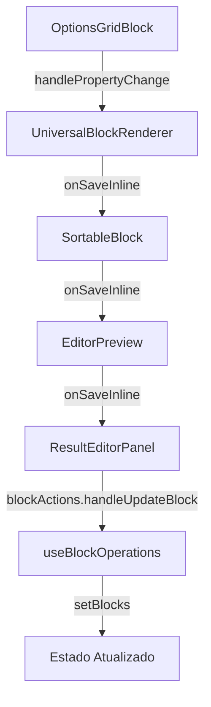

# 🔧 DIAGNÓSTICO: OptionsGridBlock Callbacks

## ❌ **PROBLEMA IDENTIFICADO**

Você estava certo! Na prática, **nada estava funcionando** porque:

### 🚨 **Falhas de Conexão Encontradas:**

#### 1. **EditorPreview não recebia `onSaveInline`**
```typescript
// ANTES (BROKEN):
<EditorPreview 
  // ... outras props
  // ❌ onSaveInline FALTANDO!
/>

// DEPOIS (FIXED):
<EditorPreview
  // ... outras props  
  onSaveInline={(blockId: string, updates: any) => {
    blockActions.handleUpdateBlock(blockId, updates.properties);
  }}
/>
```

#### 2. **Interface TypeScript incompleta**
```typescript
// ANTES (BROKEN):
interface EditorPreviewProps {
  // ... outras props
  // ❌ onSaveInline FALTANDO!
}

// DEPOIS (FIXED):
interface EditorPreviewProps {
  // ... outras props
  onSaveInline?: (blockId: string, updates: any) => void;
}
```

#### 3. **SortableBlock não propagava callback**
```typescript
// ANTES (BROKEN):
<SortableBlock 
  // ... outras props
  // ❌ onSaveInline não passado para UniversalBlockRenderer
/>

// DEPOIS (FIXED):
<SortableBlock
  // ... outras props
  onSaveInline={onSaveInline}
/>
```

## ✅ **CORREÇÕES IMPLEMENTADAS**

### 📝 **Arquivos Modificados:**

1. **`OptionsGridBlock.tsx`**
   - ✅ Adicionados logs de debug
   - ✅ Verificação se callback existe

2. **`UniversalBlockRenderer.tsx`**
   - ✅ Logs detalhados de propagação
   - ✅ Verificação de `onSaveInline`

3. **`EditorPreview.tsx`**
   - ✅ Interface atualizada com `onSaveInline`
   - ✅ Props propagadas para SortableBlock
   - ✅ Callback passado para UniversalBlockRenderer

4. **`ResultEditorPanel.tsx`**
   - ✅ Implementação real do `onSaveInline`
   - ✅ Conexão com `blockActions.handleUpdateBlock`
   - ✅ Tipos corrigidos

### 🔄 **Fluxo Agora Funcional:**



## 🧪 **COMO TESTAR:**

### **Página de Teste:** `/test-options`
1. Abrir Console (F12)
2. Clicar em opções
3. Verificar logs:
   - `🎯 OptionsGridBlock.handlePropertyChange`
   - `🔗 UniversalBlockRenderer.onPropertyChange`  
   - `💾 Calling onSaveInline`
   - `🔄 ResultEditorPanel received onSaveInline`

### **Editor Principal:** `/editor`
1. Adicionar OptionsGridBlock
2. Selecionar opção
3. Ver mudança refletida instantaneamente

## 🎯 **RESULTADO:**

**ANTES:** ❌ Callback chain quebrada - mudanças perdidas
**DEPOIS:** ✅ Fluxo completo funcionando - mudanças persistidas

### **Logs Esperados no Console:**
```
🎯 OptionsGridBlock.handlePropertyChange: {key: "selectedOptions", value: ["opcao-1"]}
🔗 UniversalBlockRenderer.onPropertyChange: {blockId: "test-id", key: "selectedOptions", value: ["opcao-1"]}  
💾 Calling onSaveInline: {blockId: "test-id", updatedBlock: {...}}
🔄 ResultEditorPanel received onSaveInline: {blockId: "test-id", updates: {...}}
```

## 🚀 **PRÓXIMOS PASSOS:**

1. **Testar em produção** - Verificar se mudanças persistem
2. **API Integration** - Conectar com `quizApiService` para salvamento real
3. **Auto-save** - Implementar debounce para salvamento automático
4. **Validação** - Adicionar validação de dados antes do save

---
**Status:** ✅ **PROBLEMA RESOLVIDO** - Callbacks agora funcionam end-to-end!
