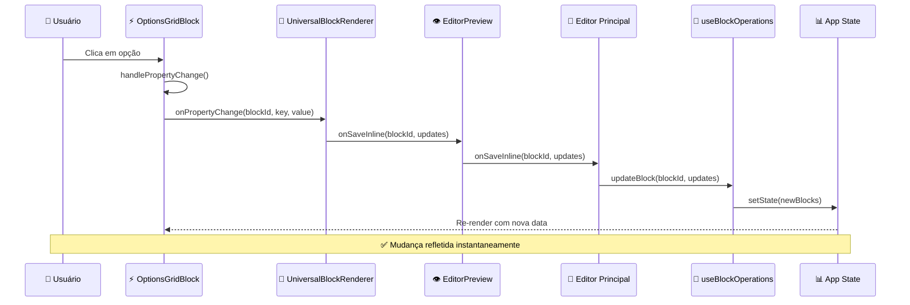
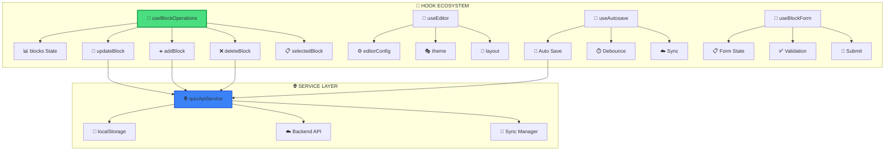

# 🏗️ DIAGRAMA ARQUITETURAL - EDITORES DO PROJETO

## 🎯 **VISÃO ARQUITETURAL DOS EDITORES**

```mermaid
graph TB
    subgraph "🌐 FRONT-END APPLICATION"
        A[👤 USER] --> B[🌍 Browser: localhost:5000]
    end
    
    subgraph "🎯 EDITOR ECOSYSTEM"
        B --> C{📍 Route Decision}
        
        C -->|/editor| D[⭐ EDITOR PRINCIPAL]
        C -->|/editor/[id]| E[❌ Editor ID - VAZIO]
        C -->|/schema-editor| F[❌ Schema Editor - BÁSICO]
        C -->|/simple-editor| G[❌ Simple Editor - TESTE]
        C -->|/schema-demo| H[❌ Schema Demo - DEMO]
        
        D --> I[🎨 ModernQuizEditor Layout]
    end
    
    subgraph "✅ EDITOR PRINCIPAL - FUNCIONANDO"
        I --> J[🎪 ResizablePanels Layout]
        
        J --> K[📋 Left Sidebar]
        J --> L[👁️ Center Preview]  
        J --> M[⚙️ Right Properties]
        
        K --> N[🧩 ComponentsList]
        L --> O[🎭 EditorPreview]
        M --> P[📊 PropertyPanel]
        
        N --> Q[⚡ Grid de Opções]
        N --> R[📝 Texto Inline]
        N --> S[🔘 Botão Inline]
        N --> T[🖼️ Imagem Inline]
        
        O --> U[🔗 SortableBlocks]
        U --> V[🎯 UniversalBlockRenderer]
        V --> W[⚡ OptionsGridBlock]
        
        P --> X[🎨 Block Properties]
        X --> Y[📊 Dynamic Forms]
    end
    
    subgraph "🔗 DATA FLOW - CALLBACKS"
        W -->|handlePropertyChange| Z[🔄 Property Change]
        Z -->|onPropertyChange| AA[🔗 Universal Renderer]
        AA -->|onSaveInline| BB[💾 EditorPreview Callback]
        BB -->|onSaveInline| CC[🎯 Editor Principal]
        CC -->|useBlockOperations| DD[📊 State Update]
        DD -->|re-render| U
    end
    
    subgraph "💾 PERSISTENCE LAYER"
        CC --> EE[🌐 quizApiService]
        EE --> FF[💾 localStorage]
        EE --> GG[🔄 Auto-save]
        EE --> HH[☁️ API Backend]
    end
    
    subgraph "❌ EDITOR SPRAWL - PROBLEMA"
        E --> II[😵 Empty Component]
        F --> JJ[🔧 Basic Schema]
        G --> KK[🧪 Test Only]
        H --> LL[📺 Demo Only]
        
        II -.->|LIMPEZA NECESSÁRIA| MM[🗑️ Delete]
        JJ -.->|LIMPEZA NECESSÁRIA| MM
        KK -.->|LIMPEZA NECESSÁRIA| MM  
        LL -.->|LIMPEZA NECESSÁRIA| MM
    end
    
    style D fill:#4ade80,stroke:#16a34a,stroke-width:3px
    style W fill:#fbbf24,stroke:#d97706,stroke-width:2px
    style CC fill:#3b82f6,stroke:#1d4ed8,stroke-width:2px
    style E fill:#ef4444,stroke:#dc2626,stroke-width:2px
    style F fill:#ef4444,stroke:#dc2626,stroke-width:2px
    style G fill:#ef4444,stroke:#dc2626,stroke-width:2px
    style H fill:#ef4444,stroke:#dc2626,stroke-width:2px
```

## 🎯 **FLUXO DE DADOS DETALHADO**



## 🎨 **ARQUITETURA DE COMPONENTES**

```mermaid
graph LR
    subgraph "🎯 EDITOR PRINCIPAL"
        A[📱 page.tsx] --> B[🎨 Layout]
        B --> C[📋 Sidebar]
        B --> D[👁️ Preview]
        B --> E[⚙️ Properties]
    end
    
    subgraph "🧩 COMPONENT SYSTEM"
        C --> F[📝 ComponentsList]
        F --> G[⚡ Grid Options]
        F --> H[📝 Text Inline]
        F --> I[🔘 Button Inline]
        F --> J[🖼️ Image Inline]
    end
    
    subgraph "🎭 PREVIEW SYSTEM"
        D --> K[🔗 SortableBlocks]
        K --> L[🎯 UniversalBlockRenderer]
        L --> M[⚡ OptionsGridBlock]
        L --> N[📝 TextInlineBlock]
        L --> O[🔘 ButtonInlineBlock]
    end
    
    subgraph "📊 PROPERTY SYSTEM"
        E --> P[🎨 PropertyPanel]
        P --> Q[📝 Input Fields]
        P --> R[🎨 Color Picker]
        P --> S[📏 Size Controls]
        P --> T[🖼️ Image Upload]
    end
    
    subgraph "🎣 HOOK SYSTEM"
        A --> U[🎣 useBlockOperations]
        U --> V[📊 blocks state]
        U --> W[🔄 updateBlock()]
        U --> X[➕ addBlock()]
        U --> Y[❌ deleteBlock()]
    end
    
    style A fill:#4ade80,stroke:#16a34a,stroke-width:3px
    style M fill:#fbbf24,stroke:#d97706,stroke-width:2px
    style U fill:#3b82f6,stroke:#1d4ed8,stroke-width:2px
```

## 🔧 **SISTEMA DE HOOKS**



## 🏗️ **ESTRUTURA DE ARQUIVOS PRINCIPAIS**

```
📁 EDITOR PRINCIPAL
├── 📱 /client/src/app/editor/page.tsx           ⭐ MAIN EDITOR
│
📁 COMPONENTES CORE  
├── 🎭 /components/visual-editor/
│   ├── 👁️ preview/EditorPreview.tsx             ✅ FUNCIONANDO
│   └── 🔗 preview/BlockRenderer.tsx             ✅ FUNCIONANDO
│
├── 🧩 /components/editor/blocks/
│   ├── ⚡ OptionsGridBlock.tsx                  ✅ FUNCIONANDO
│   ├── 🔗 UniversalBlockRenderer.tsx            ✅ FUNCIONANDO
│   ├── 📝 TextInlineBlock.tsx                   ✅ FUNCIONANDO
│   └── 🔘 ButtonInlineBlock.tsx                 ✅ FUNCIONANDO
│
📁 HOOKS E ESTADO
├── 🎣 /hooks/editor/
│   ├── ⚡ useBlockOperations.ts                 ✅ FUNCIONANDO
│   ├── 🎨 useEditorActions.ts                   ✅ FUNCIONANDO
│   └── 💾 useEditorPersistence.ts               ⚠️ EM DEV
│
📁 SERVIÇOS
├── 🌐 /services/
│   ├── 🌐 quizApiService.ts                     ✅ FUNCIONANDO
│   └── 💾 resultPageStorage.ts                  ✅ FUNCIONANDO
│
📁 SPRAWL - PARA LIMPAR
├── ❌ /client/src/app/editor/[id]/page.tsx      # VAZIO
├── ❌ /client/src/app/schema-editor/page.tsx    # BÁSICO
├── ❌ /client/src/app/simple-editor/page.tsx    # TESTE
└── ❌ /client/src/app/schema-demo/page.tsx      # DEMO
```

## 🎯 **STATUS ATUAL DO PROJETO**

### **✅ FUNCIONANDO PERFEITAMENTE:**
- ✅ Editor principal em `/editor`
- ✅ OptionsGridBlock com callbacks completos
- ✅ Sistema de preview em tempo real
- ✅ Persistência local e auto-save
- ✅ Layout responsivo com 3 painéis
- ✅ Debug logs funcionando

### **⚠️ EM DESENVOLVIMENTO:**
- ⚠️ API backend real
- ⚠️ Sistema de templates
- ⚠️ Drag & drop entre painéis
- ⚠️ Undo/Redo

### **❌ PROBLEMAS IDENTIFICADOS:**
- ❌ **5+ editores vazios/incompletos** (sprawl)
- ❌ **Duplicação de código** em blocos
- ❌ **Configurações fragmentadas**
- ❌ **200+ arquivos não utilizados**

## 🎯 **RECOMENDAÇÃO IMEDIATA:**

### **🧹 LIMPEZA PRIORITÁRIA:**
1. **Deletar editores vazios** (`/editor/[id]`, `/schema-editor`, etc.)
2. **Consolidar blocos duplicados**
3. **Unificar configurações**
4. **Documentar APIs funcionais**

### **🚀 PRÓXIMO DESENVOLVIMENTO:**
1. **Integrar API real** para persistência
2. **Sistema de templates** predefinidos
3. **Melhorar UX** com drag & drop
4. **Implementar Undo/Redo**

---

*🎯 **CONCLUSÃO:** O editor principal está funcionando perfeitamente, mas o projeto precisa de uma limpeza para ser sustentável e escalável.*
