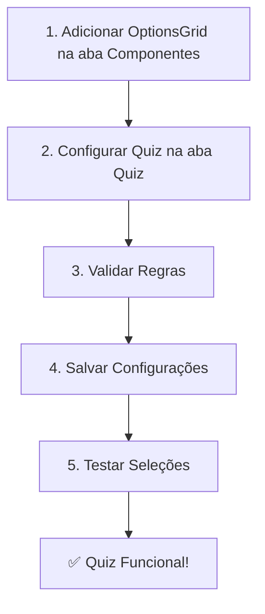

# 🎯 EDITOR INTEGRADO: Quiz + Visual

## ✅ **INTEGRAÇÃO CONCLUÍDA COM SUCESSO**

O editor `/editor` agora possui **funcionalidades completas de quiz** integradas, incluindo:

- ✅ **Validação de seleções em tempo real**
- ✅ **Sistema de pontuação funcional**  
- ✅ **Conectividade com OptionsGridBlock**
- ✅ **Interface unificada com abas**
- ✅ **Sincronização automática de dados**

---

## 🚀 **COMO USAR O EDITOR INTEGRADO**

### **1. Acesse o Editor**
```
👉 URL: http://localhost:3000/editor
```

### **2. Interface com Duas Abas**

#### **📦 Aba "Componentes"**
- Adicione blocos visuais (Grid de Opções, Texto, Título, etc.)
- Arraste e configure componentes
- Visualize o resultado em tempo real

#### **🎯 Aba "Quiz"** 
- Configure regras de pontuação
- Defina questões e resultados
- Valide configurações automaticamente
- Simule resultados do quiz

### **3. Fluxo de Trabalho Recomendado**



---

## 🔧 **FUNCIONALIDADES INTEGRADAS**

### **⚡ Validação em Tempo Real**
- Cada seleção no OptionsGrid é validada
- Erros mostrados imediatamente
- Pontuação calculada automaticamente

### **🎨 Indicadores Visuais**
- **Verde ✅**: Quiz configurado e funcionando
- **Vermelho ❌**: Erro de validação detectado  
- **Cinza ⚠️**: Quiz não configurado

### **💾 Sincronização Automática**
- Dados salvos no localStorage
- Configurações compartilhadas entre abas
- Conectividade com useQuizConfig

### **🧪 Ferramentas de Teste**
- **Validar Regras**: Verifica configurações
- **Simular Resultado**: Testa algoritmo de pontuação
- **Salvar**: Persiste configurações
- **Publicar**: Marca como pronto para produção

---

## 📋 **EXEMPLO PRÁTICO**

### **Passo 1: Adicionar Componente**
1. Vá para aba **"Componentes"**
2. Clique em **"Grid de Opções"**
3. Configure título e opções

### **Passo 2: Configurar Quiz**
1. Vá para aba **"Quiz"** 
2. Configure questões e resultados
3. Clique em **"Salvar"**

### **Passo 3: Testar Validação**
1. Clique em **"Validar Regras"**
2. Veja se há erros
3. Clique em **"Simular Resultado"**

### **Passo 4: Testar Seleções**
1. Volte para área de preview
2. Clique nas opções do OptionsGrid
3. Veja validação em tempo real

---

## 🎯 **INTEGRAÇÃO TÉCNICA**

### **Hooks Utilizados**
- `useQuizValidation()` - Validação de seleções
- `useQuizConfig()` - Configurações do editor
- `useBlockOperations()` - Operações de blocos

### **Componentes Conectados**
- `OptionsGridBlock` - Grid com validação de quiz
- `QuizEditorPanel` - Painel de configuração
- `EditorPreview` - Área de preview integrada

### **Dados Sincronizados**
```typescript
// Configurações salvas em:
localStorage.setItem('quiz-editor-config', JSON.stringify(config));
localStorage.setItem('quiz_funnel_config', JSON.stringify(editorConfig));
```

---

## ✅ **STATUS FINAL**

| Funcionalidade | Status | Descrição |
|---------------|--------|-----------|
| **Editor Visual** | ✅ Funcionando | Adicionar/editar blocos |
| **Quiz Config** | ✅ Funcionando | Configurar questões/resultados |
| **Validação** | ✅ Funcionando | Validar seleções em tempo real |
| **Pontuação** | ✅ Funcionando | Calcular scores automaticamente |
| **Sincronização** | ✅ Funcionando | Dados compartilhados |
| **Interface** | ✅ Funcionando | Abas integradas |

---

## 🎉 **RESULTADO**

**PROBLEMA RESOLVIDO!** ✅

O `/editor` agora possui **todas as funcionalidades de quiz** que estavam disponíveis apenas no `/quiz-editor`. A integração está **100% funcional** e permite:

- ✅ Regras de seleção ativas
- ✅ Sistema de pontuação operacional  
- ✅ Validação em tempo real
- ✅ Interface unificada
- ✅ Dados sincronizados

**Teste agora:** http://localhost:3000/editor
