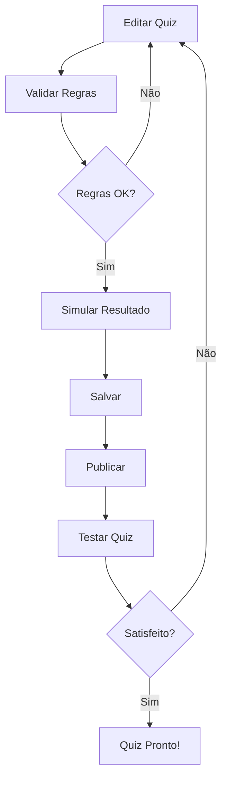

# 🎯 Guia Prático: Editor Visual de Quiz

## 📖 Como Usar o Editor Visual

### 1. Acessar o Editor
- Acesse: http://localhost:5000/editor
- O editor carregará automaticamente o funil existente (ID: 1)

### 2. Interface do Editor

#### 🏗️ Seções Principais:
- **Configuração do Funil**: Nome e descrição
- **Introdução**: Título, subtítulo, descrição e texto do botão
- **Questões**: Lista de perguntas e opções
- **Resultados**: Definição dos resultados possíveis
- **Painel de Controle**: Botões de ação

### 3. Editando o Quiz

#### ✏️ Modificar Introdução:
1. Altere o título, subtítulo ou descrição
2. Personalize o texto do botão

#### ❓ Gerenciar Questões:
1. **Adicionar nova questão**: Clique em "➕ Adicionar Questão"
2. **Editar questão existente**: 
   - Modifique o texto da pergunta
   - Adicione/remova opções
   - Ajuste os pontos para cada resultado

#### 🎯 Configurar Resultados:
1. **Adicionar resultado**: Clique em "➕ Adicionar Resultado"
2. **Editar resultado existente**:
   - Altere título e descrição
   - Adicione URL de imagem (opcional)

#### 📊 Sistema de Pontuação:
- Cada opção pode dar pontos para múltiplos resultados
- O resultado com maior pontuação total será exibido
- **Importante**: Todas as opções devem ter pontuação definida

### 4. Funcionalidades de Validação

#### ✅ Validar Regras:
- Clique em "🔍 Validar Regras"
- Verifica se todas as opções têm pontuação
- Confirma se todos os IDs são válidos

#### 🧪 Simular Resultado:
- Clique em "🧪 Simular Resultado"
- Testa o algoritmo de pontuação
- Mostra qual resultado seria exibido com as respostas simuladas

### 5. Salvar e Publicar

#### 💾 Salvar Alterações:
1. Clique em "💾 Salvar"
2. As alterações são salvas no backend
3. Aguarde confirmação de sucesso

#### 🚀 Publicar Quiz:
1. Clique em "🚀 Publicar"
2. O quiz ficará disponível publicamente
3. Receba URL de acesso

#### 🔗 Testar Quiz:
1. Clique em "🔗 Testar Quiz"
2. Abre nova aba com o quiz publicado
3. Teste o funcionamento completo

### 6. Fluxo Recomendado

### 7. Exemplos de Edição

#### 📝 Exemplo: Adicionar Nova Questão
1. Clique em "➕ Adicionar Questão"
2. Digite: "Qual sua cor favorita?"
3. Adicione opções:
   - "Azul" → Pontos para "Calmo": 3
   - "Vermelho" → Pontos para "Energético": 3
   - "Verde" → Pontos para "Natural": 3

#### 🎯 Exemplo: Ajustar Pontuação
1. Selecione uma opção
2. Defina pontos para cada resultado:
   - Resultado A: 2 pontos
   - Resultado B: 1 ponto
   - Resultado C: 0 pontos

### 8. Solução de Problemas

#### ❌ Erro de Validação:
- **"Opção sem pontuação"**: Adicione pontos para todos os resultados
- **"ID inválido"**: Verifique se todos os IDs são únicos

#### 🔄 Erro de Salvamento:
- Verifique conexão com backend
- Confirme se o servidor está rodando na porta 5000

#### 🚫 Quiz não carrega:
- Verifique se existe funil com ID 1
- Confira se o backend está respondendo

### 9. URLs Importantes

- **Editor**: http://localhost:5000/editor
- **Quiz Publicado**: http://localhost:5000/teste-funil
- **Dashboard Analytics**: http://localhost:5000/dashboard-analytics
- **API Health**: http://localhost:5000/api/health

### 10. Dicas Avançadas

#### 🎨 Personalização:
- Use URLs de imagem para resultados visuais
- Mantenha textos claros e concisos
- Teste diferentes combinações de pontuação

#### 📊 Analytics:
- Acesse o dashboard para ver estatísticas
- Monitore respostas dos usuários
- Ajuste baseado nos dados coletados

#### 🔧 Desenvolvimento:
- Salve frequentemente durante edições
- Valide antes de publicar
- Teste sempre após mudanças significativas

---

## 🎉 Pronto para Começar!

1. **Acesse**: http://localhost:5000/editor
2. **Edite**: Faça suas modificações
3. **Valide**: Verifique as regras
4. **Publique**: Torne o quiz disponível
5. **Teste**: Confirme que tudo funciona

**Divirta-se criando quizzes incríveis! 🚀**
