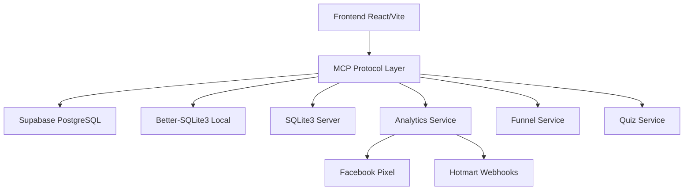

# 📋 MCP Protocol - Model Context Protocol

## 🎯 Visão Geral do Protocolo

O **Model Context Protocol (MCP)** do projeto Quiz Quest Challenge Verse estabelece padrões unificados de comunicação entre múltiplos sistemas de banco de dados, garantindo consistência, escalabilidade e manutenibilidade do projeto.

### 🏗️ Arquitetura do Sistema



### 🎯 Objetivos do Protocolo

- **Unificação**: Padronizar comunicação entre sistemas de dados
- **Consistência**: Garantir formato uniforme de dados
- **Escalabilidade**: Facilitar adição de novos sistemas
- **Manutenibilidade**: Simplificar debugging e manutenção
- **Fallback**: Estabelecer sistemas de contingência

---

## 2. Configurações de Ambiente

### 🔧 Estrutura de Configuração

```typescript
interface MCPEnvironmentConfig {
  // Database Configuration
  database: {
    primary: 'supabase' | 'sqlite' | 'better-sqlite3';
    fallback: 'supabase' | 'sqlite' | 'better-sqlite3';
    connections: DatabaseConnections;
  };
  
  // Analytics Configuration
  analytics: {
    providers: AnalyticsProvider[];
    fallbackMode: boolean;
  };
  
  // Environment Settings
  environment: 'development' | 'staging' | 'production';
  features: FeatureFlags;
}
```

### 🌍 Configurações por Ambiente

#### **Produção (Production)**
```bash
# .env.production
NODE_ENV=production
MCP_PRIMARY_DB=supabase
MCP_FALLBACK_DB=sqlite
MCP_SYNC_ENABLED=true

# Supabase Configuration
SUPABASE_URL=https://pwtjuuhchtbzttrzoutw.supabase.co
SUPABASE_ANON_KEY=eyJhbGciOiJIUzI1NiIsInR5cCI6IkpXVCJ9...

# Analytics
FACEBOOK_PIXEL_ID=123456789012345
FACEBOOK_ACCESS_TOKEN=your_production_token
HOTMART_WEBHOOK_SECRET=your_production_secret
```

#### **Desenvolvimento (Development)**
```bash
# .env.development
NODE_ENV=development
MCP_PRIMARY_DB=better-sqlite3
MCP_FALLBACK_DB=supabase
MCP_SYNC_ENABLED=false

# Local Database
LOCAL_DB_PATH=./dev.db
LOCAL_DB_WAL_MODE=true

# Test Analytics
FACEBOOK_PIXEL_ID=123456789012345
FACEBOOK_TEST_EVENT_CODE=TEST12345
```

#### **Teste (Testing)**
```bash
# .env.test
NODE_ENV=test
MCP_PRIMARY_DB=sqlite
MCP_FALLBACK_DB=memory
MCP_SYNC_ENABLED=false

# In-memory Database
TEST_DB_PATH=:memory:
```

### 🔄 Sistema de Fallback

```typescript
interface FallbackConfig {
  primary: DatabaseProvider;
  secondary: DatabaseProvider;
  tertiary?: DatabaseProvider;
  
  fallbackTriggers: {
    connectionTimeout: number; // ms
    maxRetries: number;
    errorThreshold: number;
  };
  
  syncStrategy: 'immediate' | 'batch' | 'manual';
}
```

---

## 3. Schemas e Estruturas de Dados

### 🗄️ Schema Unificado

#### **Funnel Schema**
```typescript
interface MCPFunnelSchema {
  // Universal Fields
  id: string;
  name: string;
  description?: string;
  user_id: string;
  
  // Status & Versioning
  is_published: boolean;
  version: number;
  status: 'draft' | 'published' | 'archived';
  
  // Configuration
  settings: FunnelSettings;
  theme: FunnelTheme;
  
  // Pages
  pages: FunnelPage[];
  
  // Metadata
  metadata: {
    created_at: string; // ISO 8601
    updated_at: string; // ISO 8601
    last_modified_by: string;
    tags: string[];
  };
}
```

#### **Quiz Schema**
```typescript
interface MCPQuizSchema {
  // Universal Fields
  id: string;
  title: string;
  description?: string;
  
  // Configuration
  config: QuizConfig;
  questions: QuizQuestion[];
  
  // Results
  results: QuizResult[];
  style_mapping: StyleMapping;
  
  // Metadata
  metadata: {
    created_at: string;
    updated_at: string;
    total_responses: number;
    completion_rate: number;
  };
}
```

#### **Analytics Schema**
```typescript
interface MCPAnalyticsSchema {
  // Event Tracking
  events: {
    id: string;
    event_type: 'page_view' | 'quiz_start' | 'quiz_complete' | 'conversion';
    user_id?: string;
    session_id: string;
    timestamp: string;
    
    // UTM Tracking
    utm_source?: string;
    utm_medium?: string;
    utm_campaign?: string;
    utm_content?: string;
    utm_term?: string;
    
    // Event Data
    properties: Record<string, any>;
  }[];
  
  // User Tracking
  users: {
    id: string;
    first_seen: string;
    last_seen: string;
    total_sessions: number;
    conversion_events: number;
  }[];
}
```

### 🔄 Mapeamento Entre Sistemas

#### **Supabase ↔ SQLite Mapping**
```typescript
const MCPFieldMapping = {
  // Funnel Mapping
  funnel: {
    supabase: {
      table: 'funnels',
      id_field: 'id',
      timestamp_fields: ['created_at', 'updated_at']
    },
    sqlite: {
      table: 'funnels_local',
      id_field: 'id',
      timestamp_fields: ['created_at', 'updated_at']
    },
    field_mappings: {
      'user_id': 'user_id',
      'is_published': 'published',
      'settings': 'config_json'
    }
  },
  
  // Quiz Mapping
  quiz: {
    supabase: {
      table: 'quizzes',
      id_field: 'id'
    },
    sqlite: {
      table: 'quiz_data',
      id_field: 'quiz_id'
    }
  }
};
```

---

## 4. APIs e Interfaces

### 🔌 Interface Unificada de Dados

```typescript
interface MCPDataInterface {
  // CRUD Operations
  create<T>(table: string, data: T): Promise<MCPResponse<T>>;
  read<T>(table: string, query: MCPQuery): Promise<MCPResponse<T[]>>;
  update<T>(table: string, id: string, data: Partial<T>): Promise<MCPResponse<T>>;
  delete(table: string, id: string): Promise<MCPResponse<boolean>>;
  
  // Bulk Operations
  bulkCreate<T>(table: string, data: T[]): Promise<MCPResponse<T[]>>;
  bulkUpdate<T>(table: string, updates: BulkUpdate<T>[]): Promise<MCPResponse<number>>;
  
  // Query Operations
  query<T>(sql: string, params?: any[]): Promise<MCPResponse<T[]>>;
  count(table: string, query?: MCPQuery): Promise<MCPResponse<number>>;
  exists(table: string, query: MCPQuery): Promise<MCPResponse<boolean>>;
  
  // Transaction Support
  transaction<T>(operations: MCPOperation[]): Promise<MCPResponse<T>>;
}
```

### 📡 Response Format Padrão

```typescript
interface MCPResponse<T> {
  success: boolean;
  data?: T;
  error?: MCPError;
  metadata: {
    timestamp: string;
    provider: DatabaseProvider;
    execution_time: number;
    query_count: number;
  };
}

interface MCPError {
  code: string;
  message: string;
  details?: any;
  stack?: string;
  retry_after?: number;
}
```

### 🔍 Query Interface

```typescript
interface MCPQuery {
  // Filtering
  where?: WhereClause[];
  
  // Sorting
  orderBy?: {
    field: string;
    direction: 'asc' | 'desc';
  }[];
  
  // Pagination
  limit?: number;
  offset?: number;
  
  // Relationships
  include?: string[];
  
  // Full-text Search
  search?: {
    fields: string[];
    term: string;
  };
}

interface WhereClause {
  field: string;
  operator: 'eq' | 'neq' | 'gt' | 'gte' | 'lt' | 'lte' | 'in' | 'like' | 'between';
  value: any;
  logical?: 'and' | 'or';
}
```

---

## 5. Operações Padronizadas

### 📝 CRUD Padronizado

#### **Funnel Operations**
```typescript
class MCPFunnelService {
  async createFunnel(data: CreateFunnelData): Promise<MCPResponse<Funnel>> {
    return this.adapter.create('funnels', {
      ...data,
      id: generateUUID(),
      created_at: new Date().toISOString(),
      updated_at: new Date().toISOString(),
      version: 1,
      status: 'draft'
    });
  }
  
  async getFunnel(id: string): Promise<MCPResponse<Funnel>> {
    return this.adapter.read('funnels', {
      where: [{ field: 'id', operator: 'eq', value: id }],
      include: ['pages', 'analytics']
    });
  }
  
  async updateFunnel(id: string, data: UpdateFunnelData): Promise<MCPResponse<Funnel>> {
    const updateData = {
      ...data,
      updated_at: new Date().toISOString(),
      version: INCREMENT('version')
    };
    
    return this.adapter.update('funnels', id, updateData);
  }
  
  async publishFunnel(id: string): Promise<MCPResponse<Funnel>> {
    return this.updateFunnel(id, {
      is_published: true,
      status: 'published',
      published_at: new Date().toISOString()
    });
  }
}
```

#### **Quiz Operations**
```typescript
class MCPQuizService {
  async createQuiz(data: CreateQuizData): Promise<MCPResponse<Quiz>> {
    const quiz = await this.adapter.create('quizzes', {
      ...data,
      id: generateUUID(),
      created_at: new Date().toISOString()
    });
    
    // Create questions
    if (data.questions?.length) {
      await this.bulkCreateQuestions(quiz.data.id, data.questions);
    }
    
    return quiz;
  }
  
  async getQuizWithResponses(id: string): Promise<MCPResponse<QuizWithAnalytics>> {
    const [quiz, responses] = await Promise.all([
      this.adapter.read('quizzes', { where: [{ field: 'id', operator: 'eq', value: id }] }),
      this.adapter.read('quiz_responses', { where: [{ field: 'quiz_id', operator: 'eq', value: id }] })
    ]);
    
    return {
      success: true,
      data: {
        ...quiz.data[0],
        responses: responses.data,
        analytics: this.calculateAnalytics(responses.data)
      }
    };
  }
}
```

### 🔄 Sincronização Entre Sistemas

```typescript
interface MCPSyncService {
  // Full Sync
  syncAll(): Promise<MCPResponse<SyncReport>>;
  
  // Incremental Sync
  syncSince(timestamp: string): Promise<MCPResponse<SyncReport>>;
  
  // Table-specific Sync
  syncTable(table: string): Promise<MCPResponse<SyncReport>>;
  
  // Conflict Resolution
  resolveConflicts(conflicts: DataConflict[]): Promise<MCPResponse<ResolutionReport>>;
}

interface SyncReport {
  tables_synced: string[];
  records_created: number;
  records_updated: number;
  records_deleted: number;
  conflicts_found: number;
  execution_time: number;
}
```

---

## 6. Tratamento de Erros

### ⚠️ Códigos de Erro Padronizados

```typescript
enum MCPErrorCode {
  // Connection Errors
  CONNECTION_TIMEOUT = 'MCP_001',
  CONNECTION_REFUSED = 'MCP_002',
  CONNECTION_LOST = 'MCP_003',
  
  // Data Errors
  VALIDATION_ERROR = 'MCP_101',
  CONSTRAINT_VIOLATION = 'MCP_102',
  DATA_NOT_FOUND = 'MCP_103',
  DUPLICATE_KEY = 'MCP_104',
  
  // Permission Errors
  UNAUTHORIZED = 'MCP_201',
  FORBIDDEN = 'MCP_202',
  QUOTA_EXCEEDED = 'MCP_203',
  
  // System Errors
  INTERNAL_ERROR = 'MCP_301',
  SERVICE_UNAVAILABLE = 'MCP_302',
  TIMEOUT = 'MCP_303',
  
  // Sync Errors
  SYNC_CONFLICT = 'MCP_401',
  SYNC_FAILED = 'MCP_402',
  VERSION_MISMATCH = 'MCP_403'
}
```

### 🔧 Error Handler

```typescript
class MCPErrorHandler {
  static handle(error: any, context: ErrorContext): MCPError {
    const mcpError: MCPError = {
      code: this.mapErrorCode(error),
      message: this.formatMessage(error),
      details: this.extractDetails(error),
      timestamp: new Date().toISOString()
    };
    
    // Log error
    this.logError(mcpError, context);
    
    // Determine retry strategy
    mcpError.retry_after = this.calculateRetryDelay(mcpError.code);
    
    return mcpError;
  }
  
  static shouldRetry(error: MCPError): boolean {
    const retryableCodes = [
      MCPErrorCode.CONNECTION_TIMEOUT,
      MCPErrorCode.CONNECTION_LOST,
      MCPErrorCode.SERVICE_UNAVAILABLE,
      MCPErrorCode.TIMEOUT
    ];
    
    return retryableCodes.includes(error.code as MCPErrorCode);
  }
}
```

### 🔄 Retry Strategy

```typescript
interface MCPRetryConfig {
  maxRetries: number;
  baseDelay: number; // ms
  maxDelay: number; // ms
  backoffMultiplier: number;
  jitter: boolean;
}

class MCPRetryHandler {
  async executeWithRetry<T>(
    operation: () => Promise<T>,
    config: MCPRetryConfig
  ): Promise<T> {
    let lastError: Error;
    
    for (let attempt = 0; attempt <= config.maxRetries; attempt++) {
      try {
        return await operation();
      } catch (error) {
        lastError = error;
        
        if (attempt === config.maxRetries) break;
        
        const mcpError = MCPErrorHandler.handle(error, { attempt });
        if (!MCPErrorHandler.shouldRetry(mcpError)) break;
        
        const delay = this.calculateDelay(attempt, config);
        await this.sleep(delay);
      }
    }
    
    throw lastError;
  }
}
```

---

## 7. Monitoramento e Logs

### 📊 Sistema de Logging

```typescript
interface MCPLogger {
  // Log Levels
  debug(message: string, context?: LogContext): void;
  info(message: string, context?: LogContext): void;
  warn(message: string, context?: LogContext): void;
  error(message: string, error?: Error, context?: LogContext): void;
  
  // Performance Monitoring
  startTimer(label: string): Timer;
  endTimer(timer: Timer): void;
  
  // Custom Events
  logEvent(event: LogEvent): void;
}

interface LogContext {
  userId?: string;
  sessionId?: string;
  requestId?: string;
  operation?: string;
  table?: string;
  duration?: number;
  metadata?: Record<string, any>;
}
```

### 📈 Métricas de Performance

```typescript
interface MCPMetrics {
  // Database Metrics
  query_count: number;
  query_duration_avg: number;
  query_duration_p95: number;
  
  // Error Metrics
  error_rate: number;
  error_count_by_type: Record<string, number>;
  
  // Sync Metrics
  sync_success_rate: number;
  sync_duration_avg: number;
  conflicts_resolved: number;
  
  // System Metrics
  memory_usage: number;
  cpu_usage: number;
  active_connections: number;
}
```

### 🎯 Analytics Events

```typescript
interface MCPAnalyticsEvent {
  event_id: string;
  event_type: 'database_operation' | 'sync_operation' | 'error_occurred' | 'performance_metric';
  timestamp: string;
  
  // Event Data
  data: {
    operation?: string;
    table?: string;
    duration?: number;
    success?: boolean;
    error_code?: string;
    provider?: DatabaseProvider;
  };
  
  // Context
  context: {
    user_id?: string;
    session_id?: string;
    environment: string;
    version: string;
  };
}
```

---

## 8. Exemplos de Implementação

### 🏗️ Configuração do Adaptador

```typescript
// mcp-config.ts
import { MCPAdapter } from './mcp-adapter';
import { SupabaseProvider } from './providers/supabase';
import { SQLiteProvider } from './providers/sqlite';

export const createMCPAdapter = (): MCPAdapter => {
  const config = {
    primary: new SupabaseProvider({
      url: process.env.SUPABASE_URL!,
      key: process.env.SUPABASE_ANON_KEY!
    }),
    fallback: new SQLiteProvider({
      path: process.env.LOCAL_DB_PATH || './dev.db',
      mode: 'WAL'
    }),
    logger: new MCPLogger(),
    retryConfig: {
      maxRetries: 3,
      baseDelay: 1000,
      maxDelay: 10000,
      backoffMultiplier: 2,
      jitter: true
    }
  };
  
  return new MCPAdapter(config);
};
```

### 💻 Uso Prático no Componente

```typescript
// components/FunnelEditor.tsx
import { useMCPService } from '@/hooks/useMCPService';

export const FunnelEditor: React.FC = () => {
  const { funnelService, loading, error } = useMCPService();
  const [funnel, setFunnel] = useState<Funnel | null>(null);
  
  const handleSaveFunnel = async (data: UpdateFunnelData) => {
    try {
      const response = await funnelService.updateFunnel(funnel.id, data);
      
      if (response.success) {
        setFunnel(response.data);
        toast.success('Funil salvo com sucesso!');
      } else {
        throw new Error(response.error?.message);
      }
    } catch (error) {
      console.error('Erro ao salvar funil:', error);
      toast.error('Erro ao salvar funil');
    }
  };
  
  const handlePublishFunnel = async () => {
    try {
      const response = await funnelService.publishFunnel(funnel.id);
      
      if (response.success) {
        setFunnel(response.data);
        toast.success('Funil publicado com sucesso!');
      }
    } catch (error) {
      console.error('Erro ao publicar funil:', error);
      toast.error('Erro ao publicar funil');
    }
  };
  
  return (
    <div className="funnel-editor">
      {/* UI Components */}
    </div>
  );
};
```

### 🔌 Hook de Serviço

```typescript
// hooks/useMCPService.ts
import { useContext, useEffect, useState } from 'react';
import { MCPContext } from '@/contexts/MCPContext';

export const useMCPService = () => {
  const adapter = useContext(MCPContext);
  const [loading, setLoading] = useState(false);
  const [error, setError] = useState<MCPError | null>(null);
  
  const services = {
    funnelService: new MCPFunnelService(adapter),
    quizService: new MCPQuizService(adapter),
    analyticsService: new MCPAnalyticsService(adapter)
  };
  
  useEffect(() => {
    // Health check on mount
    adapter.healthCheck().catch(setError);
  }, [adapter]);
  
  return {
    ...services,
    loading,
    error,
    adapter
  };
};
```

---

## 9. Migração e Sincronização

### 🔄 Estratégias de Migração

#### **Migração Incremental**
```typescript
interface MCPMigration {
  version: string;
  description: string;
  up: (adapter: MCPAdapter) => Promise<void>;
  down: (adapter: MCPAdapter) => Promise<void>;
  
  // Metadata
  requires: string[]; // Dependencies
  affects: string[]; // Tables affected
  rollback_safe: boolean;
}

// Example Migration
const migration_001: MCPMigration = {
  version: '1.0.1',
  description: 'Add analytics tracking to funnels',
  
  async up(adapter) {
    await adapter.query(`
      ALTER TABLE funnels 
      ADD COLUMN analytics_config JSON,
      ADD COLUMN tracking_enabled BOOLEAN DEFAULT true
    `);
  },
  
  async down(adapter) {
    await adapter.query(`
      ALTER TABLE funnels 
      DROP COLUMN analytics_config,
      DROP COLUMN tracking_enabled
    `);
  },
  
  requires: [],
  affects: ['funnels'],
  rollback_safe: true
};
```

#### **Sincronização de Dados**
```typescript
class MCPMigrationService {
  async migrateFromSQLiteToSupabase(
    sqliteAdapter: MCPAdapter,
    supabaseAdapter: MCPAdapter
  ): Promise<MigrationReport> {
    const report: MigrationReport = {
      started_at: new Date().toISOString(),
      tables_migrated: [],
      records_migrated: 0,
      errors: []
    };
    
    try {
      // 1. Get all data from SQLite
      const tables = ['funnels', 'quiz_data', 'utm_analytics'];
      
      for (const table of tables) {
        console.log(`🔄 Migrando tabela: ${table}`);
        
        const data = await sqliteAdapter.read(table, {});
        
        if (data.success && data.data.length > 0) {
          // 2. Transform data for Supabase
          const transformedData = this.transformForSupabase(table, data.data);
          
          // 3. Insert into Supabase
          const result = await supabaseAdapter.bulkCreate(table, transformedData);
          
          if (result.success) {
            report.tables_migrated.push(table);
            report.records_migrated += transformedData.length;
          } else {
            report.errors.push({
              table,
              error: result.error?.message || 'Unknown error'
            });
          }
        }
      }
      
      report.completed_at = new Date().toISOString();
      report.success = report.errors.length === 0;
      
    } catch (error) {
      report.errors.push({
        table: 'migration_process',
        error: error.message
      });
      report.success = false;
    }
    
    return report;
  }
}
```

### 📦 Backup e Restore

```typescript
interface MCPBackupService {
  // Create Backup
  createBackup(options: BackupOptions): Promise<BackupResult>;
  
  // Restore from Backup
  restoreBackup(backupId: string, options: RestoreOptions): Promise<RestoreResult>;
  
  // List Backups
  listBackups(): Promise<BackupInfo[]>;
  
  // Cleanup Old Backups
  cleanupBackups(retention: RetentionPolicy): Promise<CleanupResult>;
}

interface BackupOptions {
  tables?: string[];
  compress: boolean;
  encryption: boolean;
  destination: 'local' | 's3' | 'gcs';
}
```

---

## 🎯 Conclusão e Benefícios

### ✅ Benefícios Implementados

1. **Padronização Completa**:
   - Interfaces unificadas para todos os sistemas de dados
   - Formato consistente de resposta e erro
   - Schemas padronizados entre diferentes provedores

2. **Robustez Operacional**:
   - Sistema de fallback automático
   - Retry strategy configurável
   - Error handling abrangente

3. **Monitoramento Avançado**:
   - Logging estruturado
   - Métricas de performance
   - Analytics de uso

4. **Escalabilidade**:
   - Arquitetura modular
   - Suporte a múltiplos provedores
   - Sincronização entre sistemas

5. **Facilidade de Manutenção**:
   - Documentação completa
   - Exemplos práticos
   - Padrões claramente definidos

### 🚀 Próximos Passos

1. **Implementação Gradual**:
   - Migrar serviços existentes para usar MCP
   - Implementar testes unitários e de integração
   - Configurar monitoramento em produção

2. **Otimizações**:
   - Performance tuning dos adaptadores
   - Cache estratégico
   - Compressão de dados

3. **Expansão**:
   - Suporte a novos provedores de dados
   - Integração com serviços externos
   - APIs públicas padronizadas

---

## 📚 Referências

- [Análise de Bancos de Dados](./ANALISE_BANCOS_DADOS_COMPLETA.md)
- [Configurações de Ambiente](./.env.example)
- [Integração Supabase](./src/integrations/supabase/)
- [Scripts de Setup](./scripts/setup_database.js)
- [Tipos TypeScript](./src/types/)
- [Configurações de Blocos](./src/config/)

---

*📄 Documento MCP v1.0 - Quiz Quest Challenge Verse*  
*🗓️ Criado em: 25 de Janeiro de 2025*  
*🎯 Status: Especificação Completa - Pronto para Implementação*