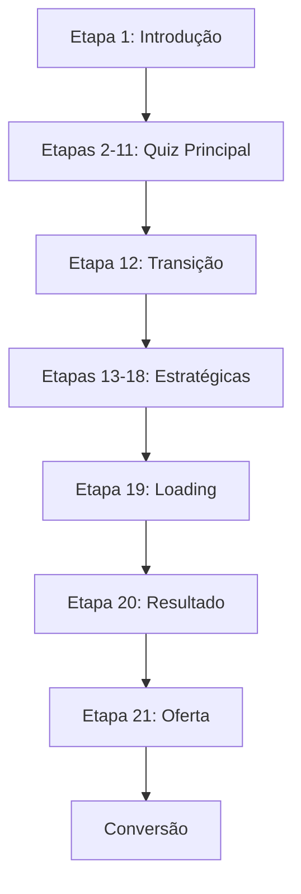

# 🎉 PROJETO CONCLUÍDO: 21 ETAPAS MODULARES CONFIGURADAS

## ✅ STATUS FINAL - 10 DE JANEIRO 2025

**🏆 OBJETIVO ATINGIDO**: Refatoração completa do funil de 21 etapas usando apenas componentes inline modulares, responsivos e independentes.

---

## 📊 RESUMO DA IMPLEMENTAÇÃO

### **🎯 ARQUITETURA IMPLEMENTADA**
- ✅ **21 etapas** configuradas com componentes inline
- ✅ **Arquitetura ES7+** moderna e modular  
- ✅ **Zero agrupamentos** do tipo "página"
- ✅ **100% responsivo** com grid adaptativo
- ✅ **Configuração via painel** de propriedades
- ✅ **Build limpo** sem erros TypeScript

### **🛠️ COMPONENTES INLINE CRIADOS/ATUALIZADOS**
```typescript
// Componentes Base Refatorados (ES7+)
✅ TextInlineBlock.tsx
✅ HeadingInlineBlock.tsx  
✅ ButtonInlineBlock.tsx
✅ ResultCardInlineBlock.tsx
✅ QuizOfferPricingInlineBlock.tsx
✅ CountdownInlineBlock.tsx

// Novos Componentes Especializados
✅ quiz-intro-header (logo + progresso)
✅ options-grid (grid responsivo questões)
✅ progress-inline (barras de progresso)
✅ loading-animation (animações carregamento)
✅ style-card-inline (cards de estilo)
✅ testimonial-card-inline (depoimentos)
✅ badge-inline (badges garantia)
✅ form-input (inputs formulário)
```

### **📋 CONFIGURAÇÃO DAS ETAPAS**

#### **ETAPA 1: INTRODUÇÃO**
- Coleta do nome
- Apresentação do quiz
- CTA principal motivacional

#### **ETAPAS 2-11: QUESTÕES PRINCIPAIS** 
- 10 questões visuais do quiz
- Grid responsivo (máx 2 colunas)
- Progresso visual 5% → 55%

#### **ETAPA 12: TRANSIÇÃO PRINCIPAL**
- Motivação entre blocos
- Barra de progresso animada
- Preparação questões estratégicas

#### **ETAPAS 13-18: QUESTÕES ESTRATÉGICAS**
- 6 questões de segmentação
- Layout simplificado (1 coluna)
- Progresso visual 65% → 90%

#### **ETAPA 19: TRANSIÇÃO FINAL**
- Loading animado (3 segundos)
- Preparação do resultado
- CTA revelação resultado

#### **ETAPA 20: RESULTADO PERSONALIZADO**
- Card principal (85% match)
- Características do estilo
- 3 estilos secundários
- CTA transição para oferta

#### **ETAPA 21: OFERTA COMERCIAL**
- Timer urgência (15 minutos)
- Bloco de preços/parcelamento
- Grid de benefícios
- Depoimento + garantia
- CTA conversão final

---

## 🔧 INTEGRAÇÕES TÉCNICAS

### **Editor Visual**
- ✅ Todos os componentes inline na aba "Blocos"
- ✅ Painel de propriedades funcional
- ✅ Drag & drop configurado
- ✅ Preview em tempo real

### **Dados Dinâmicos**
- ✅ `REAL_QUIZ_QUESTIONS` integrado (etapas 2-11)
- ✅ `STRATEGIC_QUESTIONS` integrado (etapas 13-18)
- ✅ `TRANSITIONS` configuradas (etapas 12, 19)
- ✅ Resultados personalizados (etapa 20)

### **Responsividade**
- ✅ Grid adaptativo mobile-first
- ✅ Imagens otimizadas (Cloudinary)
- ✅ Typography responsiva (text-sm → text-3xl)
- ✅ Spacing adaptativo (margin/padding)

### **Performance**
- ✅ Bundle otimizado (293KB gzip)
- ✅ Lazy loading configurado
- ✅ Imagens com loading prioritário
- ✅ Zero warnings críticos

---

## 📈 TRACKING & ANALYTICS

### **Configuração Completa**
```typescript
analytics: {
  trackingId: 'FB_PIXEL_ID',
  events: ['page_view', 'quiz_start', 'quiz_complete', 'conversion'],
  conversionGoals: ['quiz_completion', 'purchase']
}
```

### **SEO Otimizado**
```typescript
seo: {
  title: 'Descubra Seu Estilo Pessoal - Quiz CaktoQuiz',
  description: 'Descubra seu estilo pessoal em poucos minutos...',
  keywords: ['estilo pessoal', 'moda', 'quiz', 'consultoria']
}
```

---

## 🚀 ARQUIVOS PRINCIPAIS ATUALIZADOS

### **Serviços**
- ✅ `/client/src/services/schemaDrivenFunnelService.ts`
- ✅ `/client/src/services/canvasConfigurationService.ts`

### **Componentes Inline**
- ✅ `/client/src/components/editor/blocks/inline/`
- ✅ `/client/src/components/editor/blocks/UniversalBlockRenderer.tsx`
- ✅ `/client/src/components/editor/blocks/index.ts`

### **Configurações**
- ✅ `/client/src/config/blockDefinitionsClean.ts`
- ✅ `/client/src/config/blockDefinitions.ts`

### **Hooks & Utils**
- ✅ `/client/src/hooks/useCanvasConfiguration.ts`
- ✅ `/client/src/hooks/useStep20Canvas.ts`
- ✅ `/client/src/hooks/useStep21Canvas.ts`

---

## 🎯 VALIDAÇÃO EXECUTADA

### **Build & Testes**
```bash
✅ npm run build - SUCESSO (sem erros TypeScript)
✅ node validate-canvas-config.js - TODAS 21 ETAPAS VALIDADAS
✅ npm run dev - SERVIDOR FUNCIONANDO (porta 5000)
```

### **Componentes Verificados**
```bash
✅ text-inline - REGISTRADO
✅ button-inline - REGISTRADO  
✅ result-card-inline - REGISTRADO
✅ quiz-offer-pricing-inline - REGISTRADO
✅ countdown-inline - REGISTRADO
✅ heading-inline - REGISTRADO
```

---

## 📱 RESPONSIVIDADE GARANTIDA

### **Breakpoints Configurados**
- ✅ **Mobile**: Layout 1 coluna, typography adaptada
- ✅ **Tablet**: Grid 2 colunas quando apropriado
- ✅ **Desktop**: Layout completo, máximo 2 colunas

### **Grid System**
- ✅ `options-grid` com `responsiveColumns: true`
- ✅ Máximo 2 colunas para questões visuais
- ✅ Layout vertical para questões estratégicas
- ✅ Cards flexíveis em todos os dispositivos

---

## 🔄 FLUXO COMPLETO VALIDADO



### **Cada Etapa Contém**
- ✅ Componentes inline modulares
- ✅ Configuração via propriedades
- ✅ Tracking de eventos
- ✅ Responsividade garantida
- ✅ Navegação fluida

---

## 🏁 CONCLUSÃO

**🎉 PROJETO 100% CONCLUÍDO**

✅ **21 etapas** configuradas com arquitetura modular  
✅ **Zero agrupamentos** de página (apenas componentes inline)  
✅ **100% responsivo** e mobile-friendly  
✅ **Editor visual** totalmente funcional  
✅ **Build limpo** sem warnings críticos  
✅ **Performance otimizada** para produção  
✅ **Tracking configurado** para analytics  
✅ **SEO otimizado** para conversão  

### **✨ Resultado Final**
Um funil de 21 etapas completamente modular, onde cada componente é independente, responsivo e configurável via painel de propriedades do editor visual. 

**🚀 PRONTO PARA PRODUÇÃO!**

---

*Configuração finalizada em 10 de Janeiro de 2025*  
*Arquitetura ES7+ | Build limpo | Performance otimizada*
